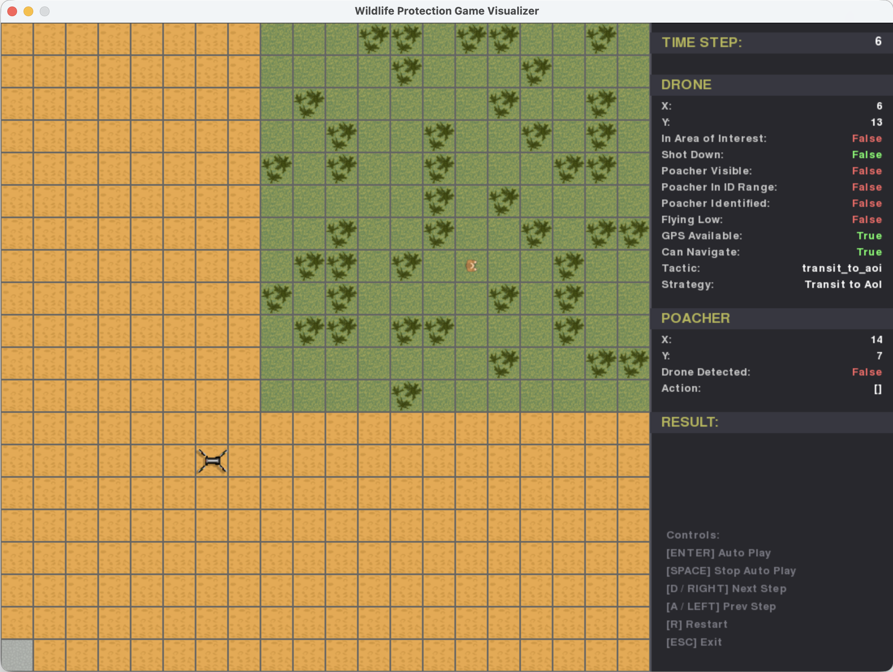

# Wildlife Protection Game: An Artifact for Evaluation of Antifragility for Autonomy in Adversarial Environments

The Wildlife Protection Game (WPG) simulates a law enforcement and wildlife
protection mission of finding and identifying a poacher.
In this mission, an autonomous drone has to transit to the area where the
poacher is located, search for the poacher, track the poacher to get enough
images for identification, and return to the base.
The goal of the artifact is to support research on *antifragile mission-level
autonomy*; that is, the planning and execution of the mission to achieve its
goal using task-level autonomous behaviors provided by the system, such as
transit to the area of interest (AoI), search poacher, etc.
WPG also includes multiple poacher behaviors with increasing capability, such
as hiding under trees to avoid detection and denying GPS to disrupt the
drone's navigation.
These behaviors disrupt mission autonomy in different ways, which antifragility
should aim to overcome.
 
Although the mission autonomy included in WPG is capable of completing the
mission with the simplest poacher behavior, the autonomy is not antifragile.
Antifragility can be realized by an additional component external to WPG that
improves the strategies used by the drone's adaptation manager or by
replacing the adaptation manager that implements mission autonomy with one
that is antifragile.
WPG provides the means to evaluate the effectiveness of antifragility by
measuring the measure of effectiveness (MoE) of the autonomous drone's mission
autonomy.



## Getting Started
### Installation
WPG runs on macOS, Linux and Windows with the following prerequisites:
- Python 3.11–3.13
- `pip`
- `venv` (optional to create a Python virtual environment and avoid dependency conflicts)
- `git`

There are two options to install it:
 - *quick installation*: suitable for using the application and evolving the drone's mission autonomy through strategy files.
   The examples in this *Getting Started* can be run with this installation.
 - *development installation*: to work with the source code, add a custom adaptation manager.
   This installation is described in the [Development Install](#development-install) section.

#### Quick Installation
If you just want to use the application without modifying the code, you can
install it directly from the git repository.

First, create a Python virtual environment:
- On Linux/macOS:
```shell
mkdir wpg
cd wpg
python3 -m venv .venv
source .venv/bin/activate
```

- On Windows:
```bat
md wpg
cd wpg
python -m venv .venv
.venv\Scripts\activate
```

To install from the repository, run:

- On Linux/macOS:
```shell
python3 -m pip install git+https://github.com/gamoreno/wpg.git
```

- On Windows:
```bat
python -m pip install git+https://github.com/gamoreno/wpg.git
```

## Running Examples
WPG can be run in single-run mode or in multi-run mode.
Examples for both follow.

### Single Run
For a single run, execute the command `wpg`. The recorded data will be saved in the
`outputs` directory with subdirectories for the date and time of the run.
The visualization (screenshot shown above) will be shown after the run completes,
allowing the replay of the simulation.
The panel on the right shows the state of the drone and the poacher.
Note that the panel shows the state at the beginning of the time step, and the
actions and the strategy shown are the ones that were decided to be executed given
that state, but have not yet been executed.

The keybindings for the visualization are shown in the lower right corner.
The mission can be replayed one step at a time or automatically.
Press the `Enter` key to replay the mission.
In this run with the base poacher behavior, the drone will be able to complete
the mission successfully.

Press `Esc` to exit the visualization.

To try with a different poacher behavior, run the following command:
```shell
wpg poacher.behavior=2
```
With this behavior, the poacher will hide under trees when it detects the drone.
The list of available poacher behaviors is shown in [Poacher Behaviors](#poacher-behaviors).
With behavior 2, it's possible that the drone will run out of battery and be lost.
This is because the baseline mission autonomy, which was good for the base poacher behavior,
does not account for the possibility of not being able to identify the poacher in a reasonable
amount of time.
Note that because of the randomness in the simulation, the drone may be able to
complete the mission.
You can either try to execute the previous command again to see if the outcome changes
or wait until the multi-run examples in the next section.

WPG includes other strategy files that have been evolved manually to deal with the
different poacher behaviors. Approaches implementing antifragility will evolve these
strategies automatically.
To see how the drone's mission autonomy changes with the different strategies,
run the following command. `strategies-v2.json` has a strategy to return to base
before running out of battery.
```shell
wpg poacher.behavior=2 adapt.strategies=strategies-v2.json
```

### Multiple Runs
To evaluate the effectiveness of antifragility, it is useful to run multiple
runs to see how the effectiveness of mission autonomy changes with different
poacher behaviors and different strategies.

The following command executes 50 simulations with the default poacher behavior
and the default mission autonomy strategies.
The seed for the random number generator is set so that we can reproduce the
conditions.

```shell
wpg --multirun run="range(50)" sim.seed=123456
```
The output for each run is saved in the `multirun` subdirectory.

For convenience, there is a tool `wpg-exp` that can be used to export the
output data for all runs to a single file.
We will use this tool to summarize the results.

```shell
wpg-exp --print-summary
```
```
Result summary:
 total_runs  average_steps  average_moe  SUCCESS  POACHER_NOT_ID  POACHER_NOT_FOUND  DRONE_LOST  UNKNOWN
         50           39.1      964.024       50               0                  0           0        0
```

We can see that the mission was successful in all the runs.

Now, let's try with a different poacher behavior.
The following command executes 50 simulations with poacher behavior 2.

```shell
wpg --multirun run="range(50)" poacher.behavior=2 sim.seed=123456
wpg-exp --print-summary
```
```
Result summary:
 total_runs  average_steps  average_moe  SUCCESS  POACHER_NOT_ID  POACHER_NOT_FOUND  DRONE_LOST  UNKNOWN
         50          72.02     744.6964       39               0                  0          11        0
```

We can see that the drone was lost in 11 out of the 50 runs because it ran out of battery.

Now, let's try with a different strategy file.
The following command executes 50 simulations with an improved strategy file.

```shell
wpg --multirun run="range(50)" poacher.behavior=2 adapt.strategies=strategies-v2.1.json sim.seed=123456
wpg-exp --print-summary
```
```
Result summary:
 total_runs  average_steps  average_moe  SUCCESS  POACHER_NOT_ID  POACHER_NOT_FOUND  DRONE_LOST  UNKNOWN
         50          63.68    902.18178       42               8                  0           0        0
```

We can see that the drone was able to identify the poacher in 42 out of the 50 runs.
There was no run in which the drone was not able to find the poacher.
However, in eight runs, the drone was not able to identify the poacher.
With this strategy file, the drone returns to base before running out of battery even
if it has not been able to achieve the mission objective.
We can see that 70% of the MoE that had been lost was recovered.

The following section provides more details about running, configuring, and extending WPG.

## Documentation

### Development Install
If you want to be able to work with the source code or extend WPG by adding a custom
adaptation manager, use this type of installation.
First, clone this repository:

```
git clone https://github.com/gamoreno/wpg.git
cd wpg
```

Then create the Python virtual environment as shown in the [Quick Installation](#quick-installation)
section.

Finally, install the package in editable mode:

- On Linux/macOS:
```shell
python3 -m pip install -e .
```

- On Windows:
```bat
python -m pip install -e .
```

### Running
This section explains how to run the application with the default
configuration. The next section explains how to configure its parameters.

#### Single Run
For a single run, execute the command `wpg`. The recorded data will be saved in the
`outputs` directory with subdirectories for the date and time of the run.
The visualization will be shown after the run completes.

#### Multiple Runs
For multiple runs, use the `--multirun` or `-m` flag and set the `run` parameter to
a list that includes the run numbers. Here are some examples:

```shell
# Run 3 (in multirun mode)
wpg --multirun run=3

# Runs 0, 5, and 8
wpg --multirun run=0,5,8

# 30 runs (0 to 29)
wpg --multirun run="range(30)"
```

The output for multiple runs is saved in the `multirun` subdirectory.
In addition to the hierarchical organization by date and time, the output
for each run is saved in a separate subdirectory.

It is possible to run multiple simulations in parallel.
See [Running Multiple Simulations in Parallel](docs/Configuration.md#running-multiple-simulations-in-parallel)
for more details.

### Configuration
This software uses [Hydra](https://hydra.cc/) for its configuration.
Configuration options are organized hierarchically by entity:
- `sim.*`: simulation configuration
- `map.*`: map configuration
- `drone.*`: drone configuration
- `poacher.*`: poacher configuration

To list all configuration options, run: `wpg --help`.
For a description of each parameter and other configuration options,
see [Configuration](docs/Configuration.md).

The default values can be overridden with command-line arguments or with a
configuration file.

#### Configuration with Command-Line Arguments
To override configuration values with command-line arguments, 
assign the value to the configuration parameter, using dots for the hierarchy,
e.g.:

```shell
wpg sim.timeout=50 map.width=20
```

#### Configuration with Configuration Files
To override configuration values with a file, create a `wpg.yaml` file in the
`conf` directory in your local workspace and add entries for the parameters
that you want to override. For example:

```yaml
sim:
  timeout: 50
map:
  width: 20
```

This is useful to run different experiments with different configurations.
Create a directory for the experiment (e.g., `experiment1`) with a `conf`
subdirectory containing the `wpg.yaml` file.
To run the experiment, make the top-level experiment directory (e.g.,
`experiment1`) the current working directory and execute `wpg` from there.
The results for this experiment will be stored in the `experiment1` directory.

Note that `wpg.yaml` must always be in a `conf` directory. For the example
above, its relative path would be `experiment1/conf/wpg.yaml`.

### Poacher Behaviors
An important part of the configuration is selecting the behavior of the
poacher. In the default behavior, the poacher just roams in the area and does
nothing to hinder the drone's mission. To be able to evaluate how antifragility
approaches deal with an increasingly capable poacher, WPG supports
different behaviors for the poacher. The `poacher.behavior` parameter specifies
the behavior of the poacher. The available behaviors are:

| Behavior | Description                                                                         |
|----------|-------------------------------------------------------------------------------------|
| 1        | Alternates between poaching and roaming in the area. Does not react to the drone.   |
| 2        | Hides under trees when it detects the drone.                                        |
| 3        | Same as 2 but has a device that denies GPS within the AoI.                          |
| 4        | Has a gun and shoots the drone if it detects it.                                    |
| 5        | Same as 4 but has a device that denies GPS within the AoI.                          |
| 6        | Behaviors 2 and 4 combined. Will shoot only if it has no tree close enough to hide. |
| 7        | Same as 6 but has a device that denies GPS within the AoI.                          |

For the behaviors with GPS denial, the effect is that the drone cannot navigate
using GPS. To navigate, it has to use optical navigation, which requires that it
flies low, which requires flying between the trees. Doing so also affects the
line of sight between the drone and the poacher. Trees affect detection for
both.

### Visualization
To visualize the simulation, run `wpg-viz`. When run without arguments, it will
replay the last simulation run by searching the `outputs` directory in the
current working directory. You can also specify a directory as a command-line
argument, for example `wpg-viz outputs/2026-04-15/15-02-03`, or point it to
a specific run in a multi-run simulation.

The visualization (screenshot shown above) will be shown after the run completes,
allowing the replay of the simulation.
The panel on the right shows the state of the drone and the poacher.
Note that the panel shows the state at the beginning of the time step, and the
actions and the strategy shown are the ones that were decided to be executed given
that state, but have not yet been executed.

The keybindings for the visualization are shown in the lower right corner.
The mission can be replayed one step at a time or automatically.
Press the `Enter` key to replay the mission.
In this run with the base poacher behavior, the drone will be able to complete
the mission successfully.

### Randomization and Reproducibility
There are multiple things that are randomized in the simulation.
By default, the simulation uses a random seed for reproducibility.
The value of this seed is saved in the log file in the output directory.
That value can be used to reproduce the simulation by setting the seed
using the `sim.seed` configuration parameter. For example, `wpg sim.seed=1234567`.

For multiple runs using `--multirun`, the seed of each run is computed based
on the base seed and the run number. If the base seed is not configured using
the `sim.seed` parameter, a random base seed is used for each run.
In that case, even though the seed for each run is saved in its output
directory, it will only help to reproduce that single run.
To reproduce a multi-run simulation, use configure the `sim.seed` parameter so
that the same base seed is used for all runs.

### Exporting Output Data
When running a multi-run simulation, the output data for each run is saved in
a separate directory. There is a convenience tool `wpg-exp` that can be used
to export the output data for all runs to a single file.
When used without arguments, it exports the last multi-run's output.
To export the data for a specific multi-run simulation, use its output
directory as an argument to `wpg-exp`.

The default export operation generates three CSV files:
- `result.csv`: contains a row for each run with the results of the simulation,
  including the measure of effectiveness.
- `merged_data.csv`: contains a row for each run with all the data recorded for both 
   the drone and the poacher. The columns have prefixes `drone_` and `poacher_` to
   identify the data for each. For example, `poacher_x` contains the x-coordinate of
   the poacher for every step of the simulation. However, `drone_poacher.x` only contains
   the x-coordinate of the poacher for the steps when the poacher was visible to the drone.
- `result_summary.csv`: contains a summary report of data in `result.csv`, with average
   MoE and the number of runs that ended with each mission outcome.

Using the `--split` option will export the output data keeping the drone and the poacher
data in separate files.

The `--print-summary` option will print a summary of the results in the console.

### Measure of Effectiveness
A measure of effectiveness is computed for each run based on the mission outcome
and a number of factors that contribute positively and negatively to the effectiveness.
The default measure of effectiveness is defined in [default-moe.yaml](src/wpg/conf/moe/default-moe.yaml).
An alternative MoE is defined in [moe-threat.yaml](src/wpg/conf/moe/moe-threat.yaml) that
accounts for threat exposure.
This MoE can be selected using the option `moe=moe-threat`.
Additional MoEs can be defined in the `conf/moe` directory.

### Evolving Mission Autonomy
With the adaptation manager included in WPG implements mission autonomy using
strategy-based adaptation.
The strategies used by the adaptation manager are defined in a JSON file.
See the default strategy file `strategies.json` for an example [src/adapt/st1/strategies.json](src/adapt/st1/strategies.json).
Each strategy has a condition expressed in [JsonLogic](https://jsonlogic.com/), and
an action consisting of a list of tactics to execute.
For a list of available variables and tactics, see [here](docs/AdaptationMgr.md).

The following are strategy files that have been evolved manually to deal with the
different poacher behaviors.
They are just examples and do not necessarily represent the best possible
strategy set for the different poacher's behaviors.

| Strategies File      | Description                                                     |
|----------------------|-----------------------------------------------------------------|
| strategies.json      | Baseline mission autonomy.                                      |
| strategies-v2.json   | Returns to base before running out of battery.                  |
| strategies-v2.1.json | Maintains a distance from the poacher so that it does not hide. |
| strategies-v3.json   | Can search for the poacher with GPS denied.                     |
| strategies-v3.1.json | Can search, track and ID the poacher with GPS denied.           |
| strategies-v4.json   | Evades gun fire.                                                |
| strategies-v5.json   | Evades gun fire and supports GPS denied missions.               |

To use a different strategy file, use the `adapt.strategies` parameter.
For example, `wpg adapt.strategies=strategies-v2.json`.

A custom strategy set can be provided in a file in the directory where `wpg` is run.
If the file is named `strategies.json`, it will be used automatically.
Otherwise, the file name must be specified with the `adapt.strategies` parameter.
For example, `wpg adapt.strategies=newstrategies.json`.

### Custom Adaptation Manager
It is possible to add a custom adaptation manager to WPG.
See [Adding a Custom Adaptation Manager](docs/AdaptationMgr.md) for more details.

An experimental adaptation manager based on hierarchical planning is included
but has not been fully tested.
This adaptation manager uses [PDDL](https://planning.wiki/guide/whatis/pddl) to
define the planning domain using strategies and uses a PDDL planner to compute
a mission plan.
It requires Docker installed and executable from the command line by the current
user.
To use this experimental adaptation manager, select it with the `adapt=hp`
configuration parameter.
```shell
wpg adapt=hp
```

## License
Wildlife Protection Game
 
Copyright 2026 Carnegie Mellon University.
 
NO WARRANTY. THIS CARNEGIE MELLON UNIVERSITY AND SOFTWARE ENGINEERING INSTITUTE MATERIAL IS FURNISHED ON AN "AS-IS" BASIS. CARNEGIE MELLON UNIVERSITY MAKES NO WARRANTIES OF ANY KIND, EITHER EXPRESSED OR IMPLIED, AS TO ANY MATTER INCLUDING, BUT NOT LIMITED TO, WARRANTY OF FITNESS FOR PURPOSE OR MERCHANTABILITY, EXCLUSIVITY, OR RESULTS OBTAINED FROM USE OF THE MATERIAL. CARNEGIE MELLON UNIVERSITY DOES NOT MAKE ANY WARRANTY OF ANY KIND WITH RESPECT TO FREEDOM FROM PATENT, TRADEMARK, OR COPYRIGHT INFRINGEMENT.
 
Licensed under a BSD (SEI)-style license, please see license.txt or contact permission@sei.cmu.edu for full terms.
 
[DISTRIBUTION STATEMENT A] This material has been approved for public release and unlimited distribution.  Please see Copyright notice for non-US Government use and distribution.
 
This Software includes and/or makes use of Third-Party Software each subject to its own license.
 
DM26-0661
